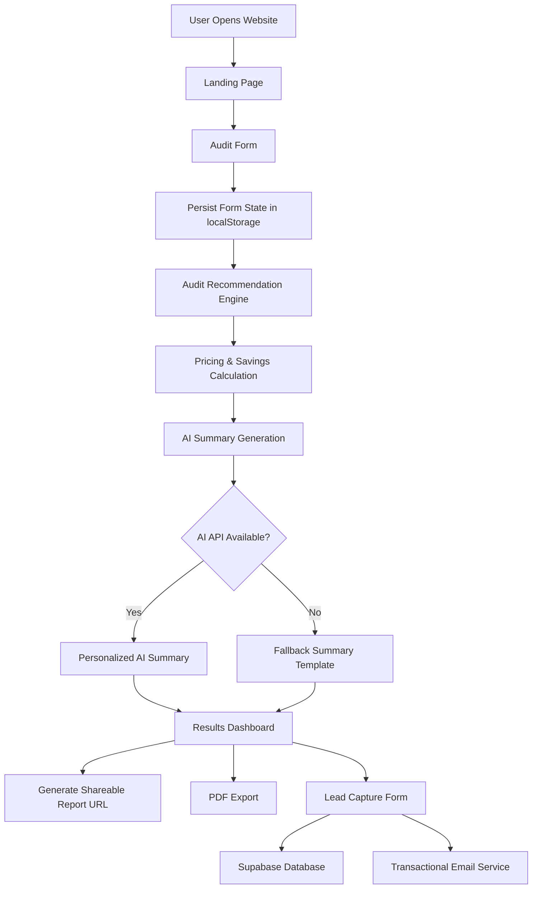

# ARCHITECTURE.md

# Architecture Overview

## System Architecture

---

# Application Flow

1. Users land on the homepage and start the AI spend audit process.

2. The audit form collects:

   * AI tool selections
   * Current subscription plans
   * Monthly spend estimates
   * Team usage details

3. Form state is persisted using browser localStorage to improve user experience and prevent accidental data loss on page reloads.

4. The audit recommendation engine evaluates:

   * Whether the selected plan fits the team size and use case
   * Potential overpayment scenarios
   * Alternative lower-cost plans
   * Opportunities to reduce AI infrastructure spending

5. The pricing engine calculates:

   * Estimated monthly savings
   * Estimated annual savings
   * Optimization opportunities
   * Financially practical recommendations

6. The application then attempts to generate an AI-powered personalized audit summary.

7. If the AI API fails or is unavailable, the application gracefully falls back to a predefined summary template.

8. The results dashboard displays:

   * Total savings
   * Per-tool recommendations
   * AI-generated summary
   * Savings visualization charts
   * PDF export functionality

9. Users can optionally save their report by entering their email address.

10. Lead information is securely stored in Supabase for future follow-up and analysis.

---

# Shareable Report URLs

Each completed audit can generate a shareable public URL that displays anonymized audit results without exposing sensitive user information such as email addresses or company names.

The public report includes:

* Tool selections
* Savings calculations
* Optimization recommendations
* Open Graph metadata for social sharing previews

This creates a lightweight viral loop while preserving user privacy.

---

# Tech Stack Decisions

## Next.js

Chosen for:

* Fast rendering performance
* Built-in routing system
* Excellent developer experience
* Easy deployment on Vercel
* Support for scalable SaaS applications

## TypeScript

Chosen for:

* Type safety
* Better maintainability
* Improved developer productivity
* Reduced runtime bugs
* Safer frontend state handling

## Tailwind CSS

Chosen for:

* Rapid UI development
* Responsive design capabilities
* Utility-first styling workflow
* Easier visual consistency
* Fast iteration during development

## Supabase

Chosen for:

* Managed PostgreSQL database
* Easy API integration
* Rapid backend setup
* Authentication and scalability support
* Strong developer experience

## Recharts

Chosen for:

* Lightweight chart rendering
* Responsive visualizations
* Easy React integration
* Suitable for SaaS dashboards

## Vercel

Chosen for:

* Seamless Next.js deployment
* Built-in CI/CD workflows
* Global CDN support
* Fast deployment iterations
* Excellent frontend hosting experience

---

# Scalability Improvements

If the platform needed to support 10,000+ audits per day, the following improvements would be implemented:

* Move audit logic into dedicated backend APIs
* Add Redis caching for repeated calculations
* Introduce background queues for AI summary generation
* Add rate limiting and abuse prevention
* Implement authentication and organization accounts
* Store audit history and analytics
* Optimize database indexing and query performance
* Add monitoring, alerting, and observability tooling
* Move AI generation workloads to asynchronous processing

---

# Security Considerations

* Environment variables are used for API keys and secrets
* Supabase manages secure database infrastructure
* No sensitive user information is exposed publicly
* Public shareable URLs intentionally exclude personally identifiable information
* Input validation prevents invalid or malformed submissions
* Audit calculations are deterministic and transparent
* Fallback summaries ensure graceful degradation if AI APIs fail

---

# Future Architecture Enhancements

Potential future improvements include:

* Real-time AI API integrations
* Benchmark comparisons across startup sizes
* Multi-user organization dashboards
* Advanced analytics and reporting
* Shareable public audit leaderboards
* Role-based access controls
* API usage ingestion from vendors
* Scheduled recurring audits
* Deeper AI-powered optimization recommendations
