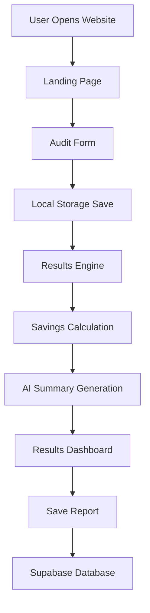

# Architecture Overview

## System Architecture

---

# Application Flow

1. Users land on the homepage and start the AI spend audit process.

2. The audit form collects:
   - AI tool
   - Current subscription plan
   - Monthly spend

3. User input is stored temporarily in browser localStorage.

4. The results engine evaluates:
   - Potential overspending
   - Better pricing options
   - Annual savings opportunities

5. The platform generates:
   - Monthly savings
   - Annual savings
   - Personalized recommendations
   - AI-generated summary

6. Users can save reports using email capture functionality.

7. Leads are stored securely in Supabase.

---

# Tech Stack Decisions

## Next.js

Chosen for:
- Fast performance
- Server-side rendering support
- Excellent developer experience
- Easy Vercel deployment

## TypeScript

Chosen for:
- Type safety
- Better scalability
- Improved developer productivity
- Reduced runtime errors

## Tailwind CSS

Chosen for:
- Rapid UI development
- Responsive design
- Utility-first styling
- Clean modern SaaS interfaces

## Supabase

Chosen for:
- Fast backend setup
- PostgreSQL database support
- Easy API integration
- Scalable infrastructure

## Vercel

Chosen for:
- Seamless Next.js deployment
- Fast global CDN
- Easy CI/CD workflow
- Excellent developer experience

---

# Scalability Improvements

If the application needed to support 10,000+ audits per day:

- Move recommendation logic into dedicated backend APIs
- Add Redis caching for repeated calculations
- Implement authentication and user accounts
- Add rate limiting and abuse prevention
- Store analytics and audit history
- Introduce background queues for AI generation
- Optimize database indexing and queries
- Add monitoring and logging infrastructure

---

# Security Considerations

- Environment variables are used for API keys
- Supabase handles database infrastructure
- No sensitive user data is exposed publicly
- Form validation prevents invalid submissions

---

# Future Architecture Enhancements

- AI-powered recommendation engine
- Shareable public audit URLs
- PDF report generation
- Team-based dashboards
- Multi-tool comparative analysis
- Real-time analytics tracking