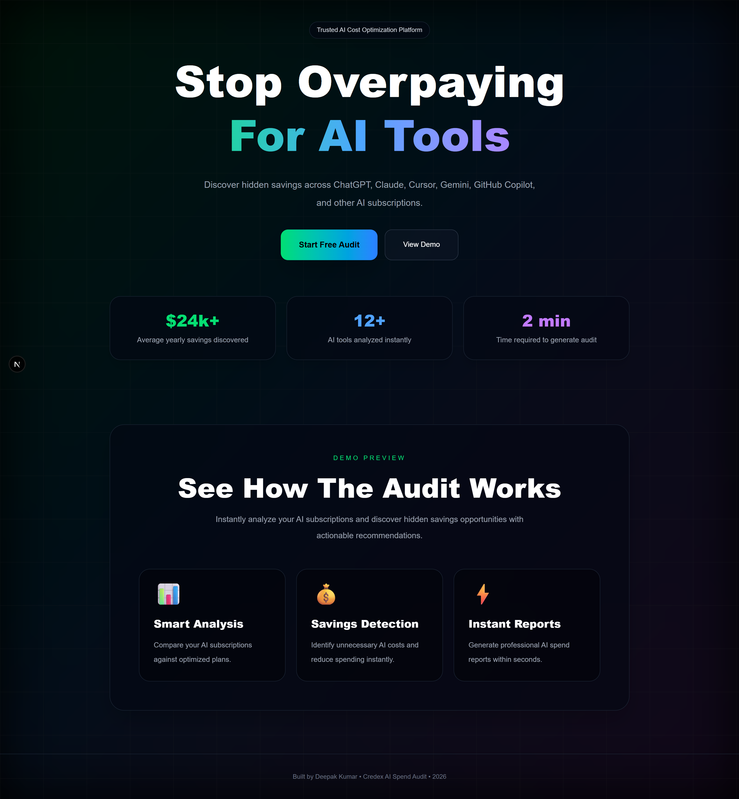
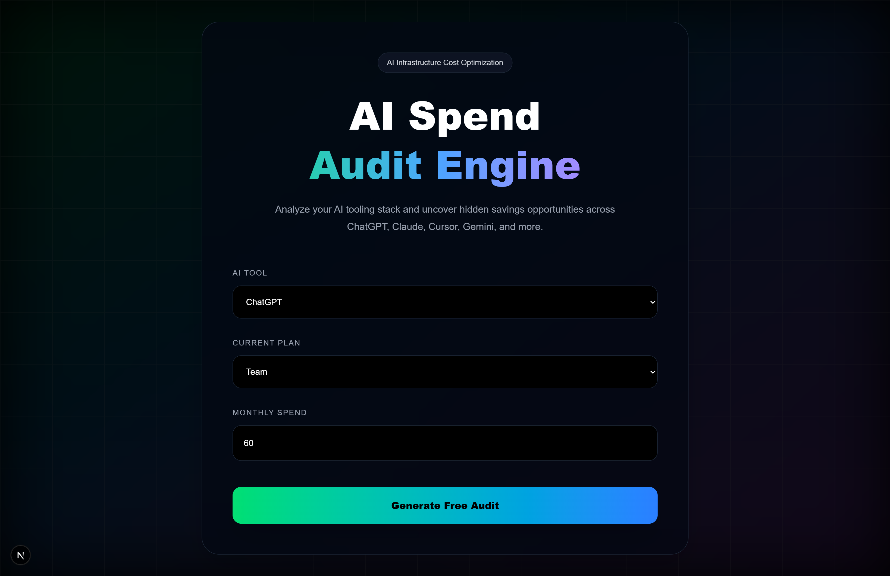
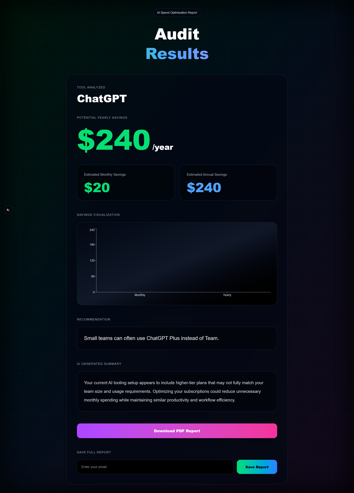

# Credex AI Spend Audit

A premium AI cost optimization platform that helps startups analyze and reduce unnecessary spending on AI tools like ChatGPT, Claude, Cursor, Gemini, and GitHub Copilot.

The platform provides personalized savings recommendations, annual/monthly cost breakdowns, AI-generated summaries, and report saving functionality using Supabase.

---

# Live Demo

[Open Live App](https://credex-ai-audit.vercel.app/)

---

# Features

- AI tooling spend audit
- Personalized savings recommendations
- Annual and monthly savings calculations
- AI-generated optimization summaries
- Responsive premium SaaS UI
- Supabase database integration
- Email capture and report saving
- Fully deployed on Vercel

---

# Tech Stack

- Next.js 16
- React
- TypeScript
- Tailwind CSS
- Supabase
- Vercel

---

# Screenshots

## Landing Page



---

## Audit Form



---

## Results Dashboard



---

# Local Setup

## Clone Repository

```bash
git clone https://github.com/Deepak165522/credex-ai-audit.git
```

## Install Dependencies

```bash
npm install
```

## Run Development Server

```bash
npm run dev
```

Open in browser:

```bash
http://localhost:3000
```

---

# Environment Variables

Create a `.env.local` file in the root directory:

```env
NEXT_PUBLIC_SUPABASE_URL=your_supabase_url
NEXT_PUBLIC_SUPABASE_ANON_KEY=your_publishable_key
```

---

# Key Features Implemented

- Premium responsive landing page
- Dynamic audit recommendation engine
- AI-generated savings summary
- Real-time email capture system
- Supabase database integration
- Production deployment on Vercel

---

# Future Improvements

- Real AI API integration
- Shareable audit links
- PDF export support
- Authentication system
- Advanced analytics dashboard
- Multi-user organization support

---

# Deployment

The application is deployed on Vercel and connected with Supabase for backend storage.


# Key Engineering Decisions

## 1. Deterministic Audit Logic Instead of Fully AI-Driven Calculations

The pricing recommendations and savings calculations were intentionally implemented using deterministic business rules rather than relying entirely on LLM outputs.

This improved:

* Pricing accuracy
* Explainability
* Predictability
* Testability

AI was limited to generating natural-language summaries only.

---

## 2. Local Storage Persistence Instead Of Mandatory Authentication

The application persists audit form state using browser localStorage instead of requiring account creation.

This reduces onboarding friction and improves audit completion rates for first-time users.

---

## 3. Supabase Chosen For Rapid Backend Development

Supabase was selected because it provides:

* Managed PostgreSQL
* Fast API setup
* Scalable backend infrastructure
* Simple frontend integration

This allowed faster iteration during the assignment timeline.

---

## 4. Premium SaaS-Style UI Prioritized Early

Significant effort was invested into:

* Responsive layouts
* Visual hierarchy
* Glassmorphism
* Charts
* Animations
* Loading states

The goal was making the product feel like a realistic launch-ready SaaS platform rather than a basic coding assignment.

---

## 5. Simplified PDF Generation For Stability

The original PDF export approach attempted to capture styled DOM elements using `html2canvas`.

Due to compatibility issues with newer Tailwind color rendering, the implementation was simplified to direct PDF generation using `jsPDF`, improving reliability and reducing rendering issues.

---

# Testing & CI

The project includes:

* Automated Jest tests for audit engine logic
* GitHub Actions CI pipeline
* ESLint validation
* Production deployment verification

Continuous Integration automatically runs tests and lint checks on every push to the `main` branch.


---

# Author

Deepak Kumar